# Final-Year-Project-FYP-Machine-Learning-Implementation
---

## 📖 Overview
The core objective of this simulation is to provide a controlled environment in which the two agents—FSM and ML-based—compete under identical gameplay conditions. Both agents are tasked with scoring goals in the presence of a dynamic goalkeeper, using different decision-making frameworks.

FSM Agent: Operates on predefined conditional logic, transitioning between states like “Approach Ball”, “Align to Goal”, and “Shoot”.

RL Agent (PPO): Learns optimal policies through trial and error, using a reward system to improve performance over time.

---

## Purpose and Relevance

This simulation acts as a sandbox for evaluating the practical applications and trade-offs of different AI strategies in interactive digital environments. It is particularly relevant for:

- Game AI prototyping

- Reinforcement learning research

- AI performance benchmarking in constrained environments
  
---

## 🧠 Machine Learning Approach

- **Techniques Used**: Reinforcement learning, provided by Unity ML-Agents
- **Data Source**: Custom datasets based on environment as per reinforcement learning
- **Evaluation Metrics**: Shoot Attempts, Goal Keeper Save Count, elapsed time

---
## Flowchart and Design
<table>
  <tr>
    <td>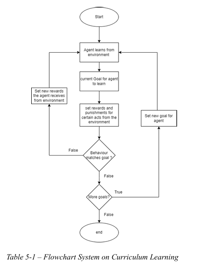</td>
    <td>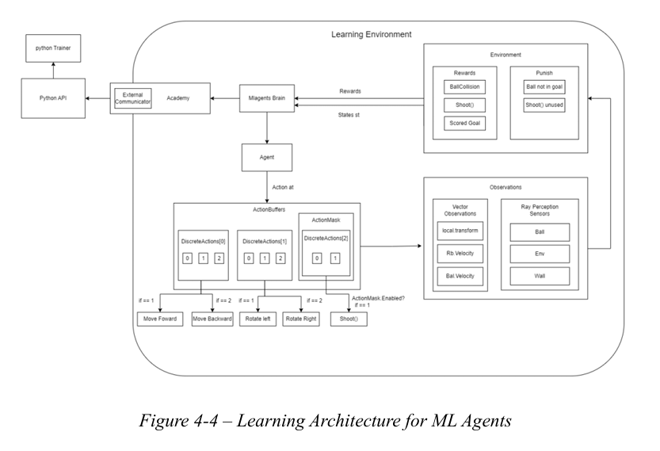</td>
  </tr>
</table>

## 📸 Screenshots

<table>
  <tr>
    <td>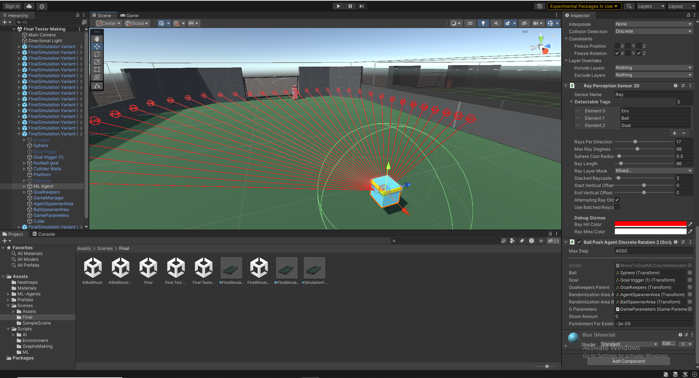</td>
    <td>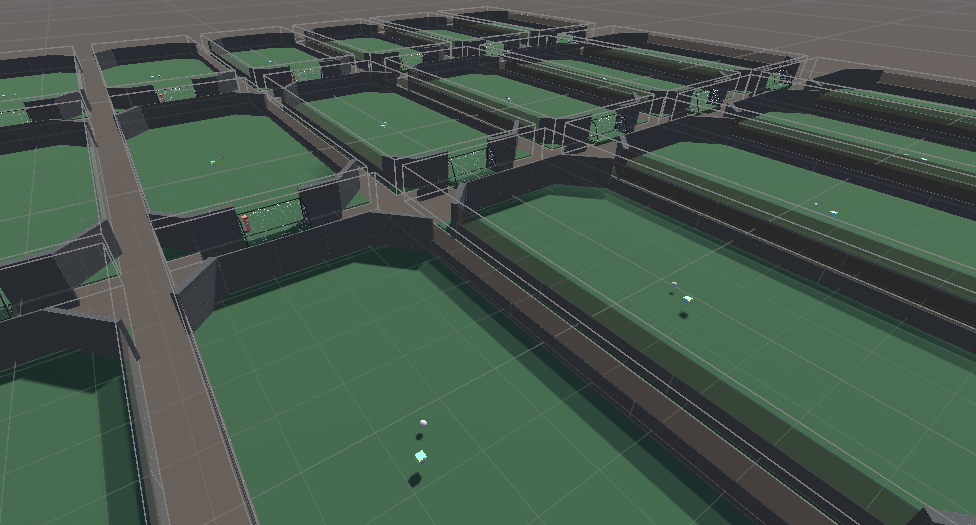</td>
  </tr>
  <tr>
    <td>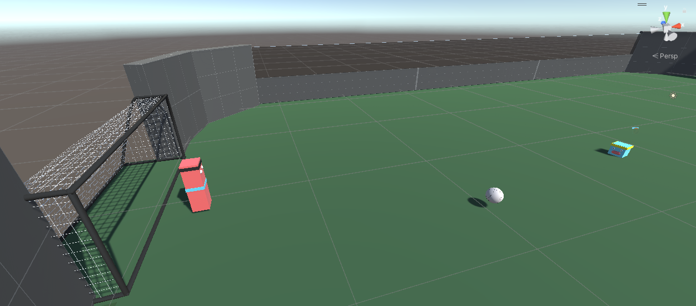</td>
    <td>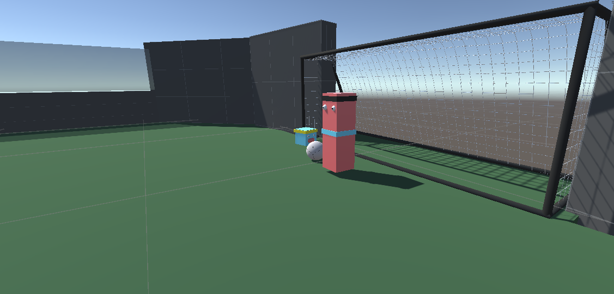</td>
  </tr>
</table>

---
## 📈 Learning Curves

<table>
  <tr>
    <td>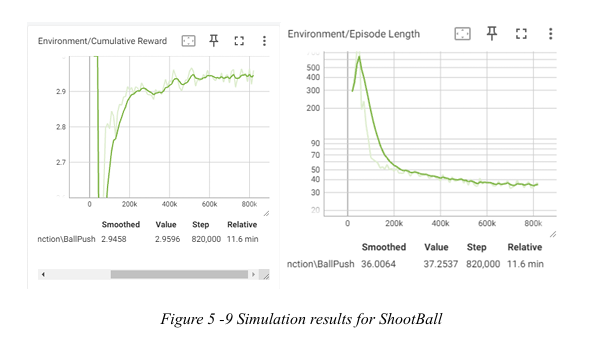</td>
    <td>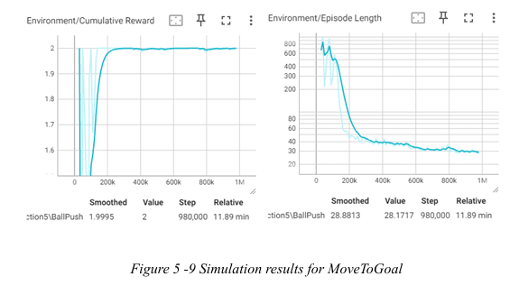</td>
  </tr>
  <tr>
    <td colspan="2">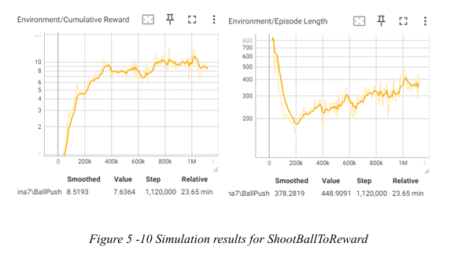</td>
  </tr>
</table>

---

## 🧪 Results

<table>
  <tr>
    <td>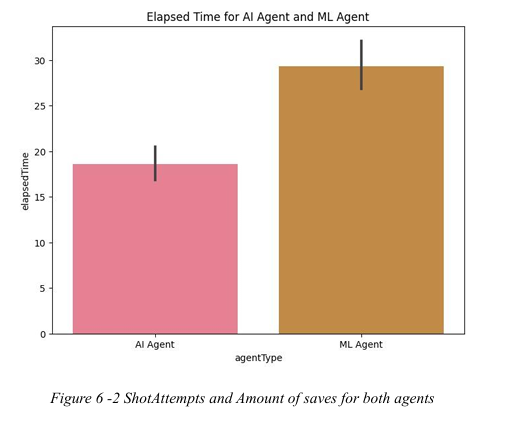</td>
    <td>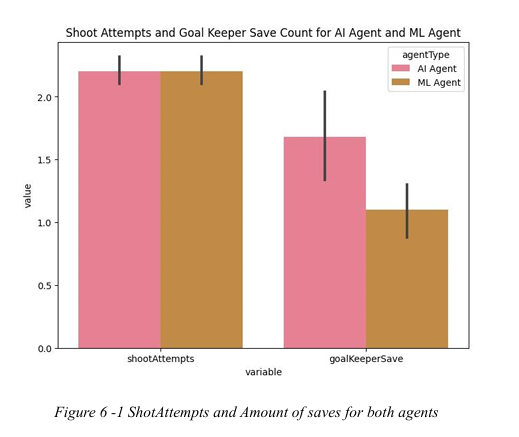</td>
  </tr>
  <tr>
    <td colspan="2">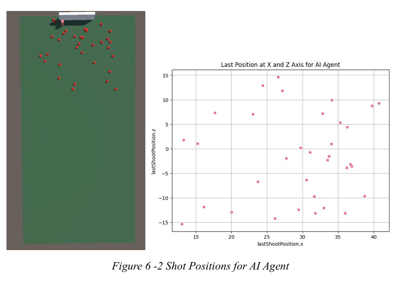</td>
    <td colspan="2">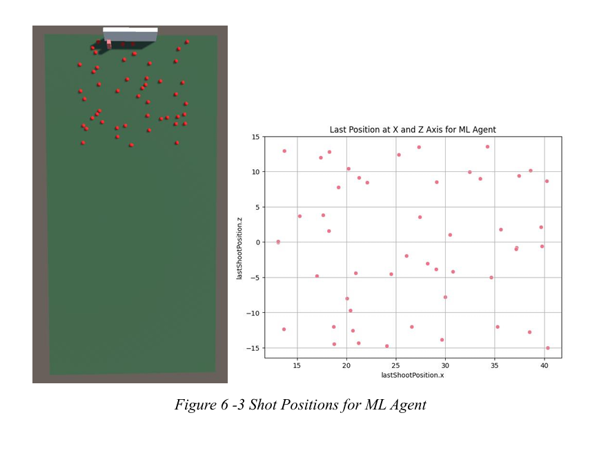</td>
  </tr>
</table>

---

## 🎥 Demo Video

Watch the full simulation demo here:

<i>Click the image above to watch on YouTube.</i>

## ⚙️ Tech Stack

- **Game Engine**: Unity 2022.3.17f1
- **Programming Language**: C#
- **ML Libraries**: TensorFlow / PyTorch / Scikit-learn 
- **Tools**: Conda / Unity ML-Agents
